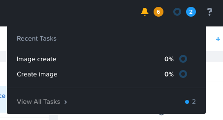

.. title:: Nutanix 101 - Infrastructure Deep Dive

.. toctree::
  :maxdepth: 2
  :caption: My Infrastructure
  :name: _nutanix101
  :hidden:

  index

.. toctree::
  :maxdepth: 2
  :caption: Appendix
  :name: _appendix
  :hidden:

---------------------------------------
Nutanix 101 - Infrastructure Deep Dive
---------------------------------------

*The estimated time to complete this lab is 60 minutes.*

Intro
+++++

In this lab you will explore Prism Central and Prism Element. You will learn how to perform cluster administration tasks such as creating VMs and configuring networks. You will learn more about Nutanix storage and image management within Nutanix AHV.

Let’s first get some terminology out of the way:

**Prism Element** - Prism Element is a service that provides the web UI for managing a Nutanix cluster and runs on every Controller VM (CVM) in the cluster. This local Prism service, referred to Prism Element, can be accessed via the IP of any individual CVM, or via the virtual IP for the cluster, which will redirect to the current Prism leader. There is no installation necessary, it is part of the core cluster services.

**Prism Central** - Prism Element is limited to a single Nutanix cluster, so Prism Central can be used to provide a multi-cluster view. It is a centralized management tool that runs as a separate instance comprised of either a single VM or a set of VMs. It is recommended to install Prism Central in a Nutanix cluster. It is possible to install in a non-Nutanix environment, however there are several limitations in doing so. These limitations are outlined in the `documentation <https://portal.nutanix.com/#/page/docs/details?targetId=Acropolis-Upgrade-Guide-v511:upg-vm-install-wc-r.html>`_.

Dashboard Overview
++++++++++++++++++

The main Prism Central dashboard is your starting point for the administration of storage, virtual machines, networking, and more. Prism Central can manage one or more Nutanix clusters.

The main dashboard has several default widgets. Identify the following on your system:

- **Impacted Cluster** - This widget identifies any registered clusters that have active (unresolved) alerts and might need attention.
- **VM Efficiency** - This widget displays the number of VMs that are considered inefficient broken down by category: overprovisioned, inactive, constrained, and bully. You can click on "View All Inefficient VMs" for more details.
- **Cluster Storage** - This widget displays information about storage use for the highest usage clusters.
- **Cluster Quick Access** - This widget will list all the Nutanix clusters managed by Prism Central and allows you to open the Prism interface for individual clusters in a new tab.
- **Manage Dashboards** - You can create custom dashboards in addition to the main dashboard.

- **Main Menu** - The main menu at the top of every screen provides access to the features of Prism Central.

Let's go over the main menu entities.

- **Search** - Prism Search is context-sensitive and is populated automatically based on where you are in Prism Central.
- **Alerts** - Important events that might require action are listed here.
- **Recent Tasks** - You can check the status of administrative tasks here. For example; you don't have to stay on the VM page when you create a VM, you can view the progress here.
- **Help** - If you need help at any time, you can access all of Nutanix’s technical documentation or the Nutanix .NEXT community forums with a single click.
- **Configuration** - Cluster and system-level management is separate from daily operations and can be accessed here.
- **User Profile** - Through your user profile, you can access more than just your profile information. This is where you can access advanced administration like nCLI, Powershell cmdlets, and the REST API Explorer.

Clusters
++++++++

Let’s view the clusters managed by this Prism Central. In the demo environment, a single cluster is being managed.

#. On the top left corner, click on :fa:`bars` > Hardware > Clusters.

   The Clusters dashboard allows you to view summary information about registered clusters. The List tab, which appears by default when you first open the page, displays a list of the registered clusters and information about them, including AOS version and hypervisor.

   .. figure:: images/03_pc_clusters_view.png

Nutanix Distributed Storage Fabric
++++++++++++++++++++++++++++++++++

The Nutanix Distributed Storage Fabric (DSF) appears to the hypervisor like any centralized storage array, but uses the CVMs and local storage in each node to provide shared storage for the cluster - the combination of compute and distributed local storage is what is now commonly referred to as Hyperconverged Infrastructure (HCI).

As a pioneer in the HCI space, Nutanix DSF is a mature solution capable of delivering the performance and resiliency needed to support many different workloads, including enterprise databases, virtual desktops, ROBO, Big Data, and more.

The two main storage constructs within the DSF are the Storage Pool and Storage Containers.

**Storage Pool** - The Storage Pool is the aggregation of all of the physical disks within a given Nutanix cluster. The cluster manages distribution of data, so configuration of additional storage pools (like LUNs in a traditional storage environment) is not required. As new nodes are added to a cluster, disks are automatically added to the pool and the cluster will begin re-distributing data to the new disks as a background task.

**Storage Containers** - Storage Containers are software-defined, logical constructs that allow you to configure storage policy for groups of VMs or vDisks. It is a logical grouping of physical storage on a Nutanix cluster. Storage containers hold the virtual disks used by entities such as VMs. A storage container can have policies applied to it such as compression, deduplication, and erasure coding.

View Storage Containers
.......................

Let's take a look at the storage containers in the demo environment.

#. Click on :fa:`bars` > Virtual Infrastructure > Storage Containers

   On this page, you can see the properties of each of the storage containers across the clusters - the `replication factor <https://nutanixbible.com/#anchor-book-of-acropolis-data-protection>`_, compression, deduplication, erasure coding, and free space.

   On a new Nutanix cluster, there are normally 3 logical storage containers created by default.

   - **default-container-xxxxx** - this is a default storage container for placing VMs.
   - **NutanixManagementShare** - this is a built-in storage container for use with Nutanix Files and Self-Service Portal features, and should not be deleted or used for VMs.
   - **SelfServiceContainer** - when uploading images in Prism Central, they will be placed in this container.

   Storage containers are created and managed on the Prism Element interface of the individual cluster.

   .. figure:: images/04_pc_storage_containers.png

Storage Views in Prism Element
..............................
To create a storage container, log in to Prism Element on the desired cluster.

#. Click on :fa:`bars` > Hardware > Clusters
#. Click on the **Cluster Name** to drill down into the cluster page.
#. Click on the **Launch Prism Element** button. This will open Prism Element in a new tab. Be sure to leave the existing tab open, for the next exercise.

   .. figure:: images/05_pc_launch_pe.png

#. On the Prism Element top menu, click on **Home** to bring down the menu.

   .. figure:: images/06_pe_main_menu.png

#. Click on **Storage**.

   The Overview dashboard displays dynamically updated information about the storage configuration in a cluster.  Take a moment to look around.

#. Click on **Diagram** for a different view.

   This view shows you a description of the physical and logical storage utilization.

#. Click on **Table**.

   In the Table view, there are three storage entities shown.

   - **Storage Containers** - Storage Containers are the logical units of storage that span a cluster.
   - **Volume Groups** - Volume Groups allow you to present an iSCSI target to VMs inside your cluster or to external systems.
   - **Storage Pool** - A storage pool is a physical collection of disks in your cluster. In general, Nutanix suggests a single storage pool per cluster. When a node is added to the cluster, the new node’s disks are automatically added to the storage pool.

#. Click on **+ Storage Container**

   Multiple storage can be created on top of a single storage pool with different policies, depending on the workload.

#. Enter in a name for the storage container, for example **mycontainer**.

   .. figure:: images/07_pe_create_storage_container.png

#. Click on **Advanced Settings**.

   Advanced Settings allow you to set a variety of policies:
   - **Redundancy Factor** - In production, Nutanix supports a redundancy factor of 2 or 3. In this single node test environment, the redundancy factor is 1.

   - **Reserved Capacity** - Entering a value in this field allows the container guaranteed reserved space from the storage pool. Reserving space for a storage container means that space is no longer available to other storage containers even if the reserved space is unused. See the `Capacity Reservation Best Practices <https://portal.nutanix.com/#/page/docs/details?targetId=Web-Console-Guide-Prism-v511:sto-capacity-reservation-best-practices-c.html#concept_p34_5y2_ml>`_ documentation for more information.

   - **Advertised Capacity** - Entering a value in this field sets the advertised capacity for this container, which is the maximum storage size that the storage container can use. If a reserved capacity is configured,  it must be set greater than or equal to the reservation on the storage container.

   - **Compression** - This allows compression to be configured on the data in the storage container. This should be checked by default for a new container. If it is not checked, check the box and type in **60** in the Delay field. For more information, see the `Compression <https://portal.nutanix.com/#/page/docs/details?targetId=Web-Console-Guide-Prism-v511:sto-compression-c.html>`_ section in the documentation.

   - **Deduplication** - This allows deduplication to be configured on the data in the storage container.  For more information and best practices, see the `Deduplication <https://portal.nutanix.com/#/page/docs/details?targetId=Web-Console-Guide-Prism-v511:sto-dedup-recommend-c.html>`_ section in the documentation.

   - **Erasure Coding** - Erasure coding increases the effective or usable capacity on a cluster. For more information about erasure coding, see the `Erasure Coding <https://portal.nutanix.com/#/page/docs/details?targetId=Web-Console-Guide-Prism-v511:wc-erasure-coding-overview-wc-c.html>`_ section in the documentation.

   - **Filesystem Whitelists** - A whitelist is a set of addresses that are allowed access to this storage container. Whitelists are used to allow appropriate traffic when unauthorized access from other sources is denied.

#. Click on **Advanced Settings** again, to close the Advanced Settings options.
#. Click on **Save** to create yuor storage container.

Congratulations! You just created a new storage container with a post-process compression delay of 60 minutes. Before moving on to the next exercise, click back to the browser tab with the Prism Central interface.

Images
++++++

Images can be uploaded to Prism for use by virtual machines. The images can be ISO files or disk image files and can be uploaded via a URL or from your local workstation.

The image service supports raw, vhd, vhdx, vmdk, vdi, iso, and qcow2 disk formats.

Add an Image
............

In this exercise you will create an image that will later be used by a virtual machine. You will create the image via a URL.

#. Click on :fa:`bars` > Virtual Infrastructure > Images
#. Click **Add Image**
#. Select the **URL** radio button.
#. In the URL field, enter in the following:

   http://s3.amazonaws.com/get-ahv-images/CentOS7.qcow2

#. Click **Upload File**.
#. The system will auto-detect the image name and type. You can modify the name and add a description if desired, and then click **Next**.

   .. figure:: images/08_pc_upload_image.png

#. Select the radio button Don’t Use Categories.

   .. figure:: images/09_pc_upload_image.png

   .. note:: You can place the image using categories. This This option is recommended for larger environments. For smaller environments, you can select to not use categories.

The image in now being uploaded. You can view the progress by clicking on the **Tasks** icon. For more details, click on **View All Tasks**.

Networks
++++++++

AHV leverages Open vSwitch (OVS) for all VM networking. OVS is an open source software switch implemented in the Linux kernel and designed to work in a multiserver virtualization environment. Each AHV server maintains an OVS instance, and all OVS instances combine to form a single logical switch.

Each node is typically uplinked to a physical switch port trunked/tagged to multiple VLANs, which will be exposed as virtual networks.

VM networking is configured through Prism (or optionally CLI/REST), making network management in AHV very simple. In the following exercise you will walk through virtual network creation in AHV.

Additional details about AHV networking can be found `here <https://nutanixbible.com/#anchor-book-of-ahv-networking>`_.

Create a Network
.................

#. Click on :fa:`bars` > Virtual Infrastructure > VMs

   The VMs page lists an inventory of all the virtual machines running on Nutanix clusters managed by this Prism Central.

   This page also allows you to configure a VM network.

#. Click on **Network Config**

   .. note::  If Prism Central is managing multiple clusters, you will be prompted to select which cluster's network you wish to view the configuration for.

   Each VM network interface is bound to a virtual network, and each virtual network is bound to a single VLAN.

   .. figure:: images/11_pc_network_config.png

   The Network Configuration screen has two tabs:

   - The **Virtual Networks** tab displays a list of the configured networks.
   - The **Internal Interfaces** tab displays a list of LAN interfaces.

   .. figure:: images/12_pc_network_config.png

#. Click **Create Network**
#. In the **Name** field, enter in a name for your network
#. In the **VLAN ID** field, enter in a number, for example 0 or 27
#. Check the box **Enable IP address management** to view the additional fields.

   .. note:: Enabling IP address management (IPAM) displays additional fields and gives control of IP addressing to the cluster. If this box is not checked, no network management is attempted, and it is assumed that management for this VLAN is handled outside of the cluster.

#. Uncheck the box **Enable IP address management**.
#. Click **Save** to save the network configuration.

   .. figure:: images/13_pc_network_config.png

#. Click the **X** to close the Network Configuration screen.

VM Management
+++++++++++++

In this exercise you will create a VM and perform some common actions on it.

Create a VM
...........

#. Click on :fa:`bars` > Virtual Infrastructure > VMs
#. Click Create VM.
#. Enter in the following fields (scroll down to view all fields):

   - VM Name - Give the VM a name, for example MyTestVM

   - vCPU - Enter 2 for vCPU

   - Memory - Enter 2 for Memory

   - Click **+ Add New Disk**. Fill in the following and leave the other fields at their default values:
     - Type - DISK

     - Operation - Clone from Image Service

     - Select Image - Select the image you uploaded earlier

     - Click **Add**

   - Click **+ Add New NIC**. Fill in the following and leave the other fields at their default values:

     - VLAN Name - default-net

     - Click **Add**

   - Click **Save**

   .. figure:: images/14_pc_create_vm.png

Congratulations! You’ve created a VM in just a few clicks. Your VM should now be visible in the list of VMs. If you don't see it here, you can always check its progress in the **Tasks** menu.  From the VM list, you can monitor your VM status, start and stop it, and look at what resources it is consuming.

Power on the VM
................

#. Check the box next to the VM you just created.
#. Click the **Actions** drop-down menu that appears.
#. Select **Power On**.

   .. figure:: images/15_pc_power_on_vm.png

Launch a Console to the VM
...........................

#. If not already checked, check the box next your VM.
#. Click **Actions >  Launch Console**.

   .. figure:: images/16_pc_launch_console.png

   The VM Console window provides 4 actions: Mount ISO, CTRL-ALT-DEL, Take Screen Capture, and Power.

   .. figure::  images/17_pc_vm_console.png

#. Close the console window by clicking **X**.

Clone the VM
.............

#. If not already checked, check the box next to your VM.
#. Click **Actions > Clone**.
#. Fill in the following and leave the other fields at their default values:

   - Number of Clones - 2

   - Prefix Name - Clone

#. Click **Save**.

   .. figure:: images/18_pc_clone_vm.png

Congratulations!  You cloned your VM. Both Nutanix snapshots and clones use a `redirect-on-write <https://nutanixbible.com/#anchor-book-of-acropolis-snapshots-and-clones>`_ algorithm to quickly and efficiently create copies of VMs as a metadata operation. You can power on the VMs and start using them right away.

Takeaways
+++++++++

- Prism Element is the Nutanix management plane that runs on every node and provides the HTML5 web interface for a single cluster.
- Prism Central is a centralized management tool that can provide a multi-cluster view.
- The Distributed Storage Fabric provides RF2 or RF3 shared storage to the cluster.
- Storage Containers allow you to define storage policy for VMs, including RF level, compression, deduplication, and erasure coding.
- AHV provides native distributed virtual switching and IP address management, simplifying virtual network management.
- AHV VMs can be managed via Prism, CLI, or REST API.
- The AHV Image Service allows you to provide a catalog of available images to be used in VM deployments.
- In a multi-node cluster, AHV provides critical features such as live migration, high availability, and dynamic VM placement out-of-the-box without additional configuration.
- Check out `The Nutanix Bible <https://nutanixbible.com/>`_ for more information about core Nutanix architecture.
